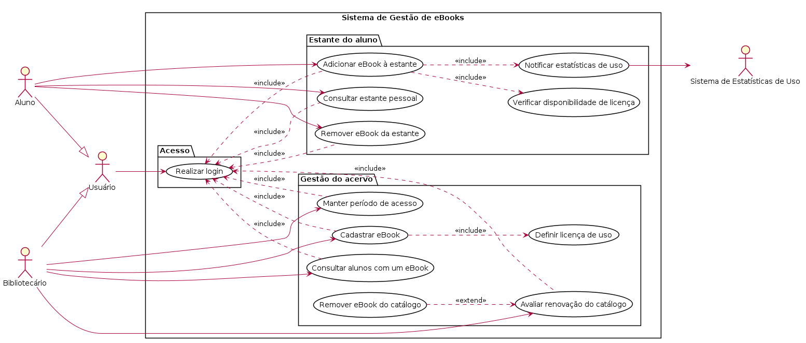

# Sistema de Gestão de eBooks da Biblioteca Universitária

Projeto da disciplina de Laboratório de Desenvolvimento de Software — Laboratório 01.

Repositório: https://github.com/lucasnmc12/lab01-ebooks-biblioteca

## Sobre o sistema

A universidade oferece aos alunos um acervo de livros digitais. A equipe da biblioteca cadastra os eBooks disponíveis a cada semestre e mantém as informações dos eBooks, dos bibliotecários e dos alunos.

Cada eBook tem título, editora, formato de arquivo (PDF ou EPUB) e categoria (literatura, técnico ou periódico), além de uma licença de uso que limita quantos alunos podem acessá-lo ao mesmo tempo, no máximo 60. Atingido o limite, novos acessos ao título ficam bloqueados até que uma das licenças em uso seja liberada.

O aluno monta uma estante pessoal com até 4 eBooks de leitura obrigatória, indicados pela disciplina, e mais 2 de leitura livre. As alterações na estante só podem ser feitas durante os períodos de acesso do semestre. Cada vez que um aluno adiciona um título, o sistema de estatísticas de uso é notificado.

Ao final do período de acesso, um eBook só permanece no catálogo licenciado do semestre seguinte se estiver na estante de pelo menos 3 alunos. Abaixo disso, a licença não é renovada e o título sai do catálogo.

Os bibliotecários também consultam quais alunos estão com um determinado eBook na estante. Todos os usuários do sistema, alunos e bibliotecários, acessam com senha.

## Documentação

- [Diagrama de casos de uso (fonte PlantUML)](docs/diagramas/casos-de-uso.puml)
- [Diagrama de casos de uso (imagem)](docs/diagramas/casos-de-uso.png)
- [Histórias de usuário](docs/historias-de-usuario.md)
- [Contribuições semanais](docs/contribuicoes/)



## Integrantes e distribuição de tarefas

### Sprint 1 (Lab01S01)

| Integrante | Casos de uso | Histórias |
| --- | --- | --- |
| Lucas Nogueira | UC07 Cadastrar eBook, UC08 Definir licença de uso, UC09 Consultar alunos com um eBook, UC10 Manter período de acesso, UC11 Avaliar renovação do catálogo, UC12 Remover eBook do catálogo | HU07 a HU12 |
| Pedro Resende | UC01 Realizar login, UC02 Adicionar eBook à estante, UC03 Remover eBook da estante, UC04 Consultar estante pessoal, UC05 Verificar disponibilidade de licença, UC06 Notificar estatísticas de uso | HU01 a HU06 |

O andamento das tarefas é acompanhado no board do GitHub Projects deste repositório.

## Estrutura do repositório

```
docs/
├── diagramas/            diagramas UML em PlantUML (.puml) e as imagens exportadas
├── historias-de-usuario.md
├── contribuicoes/        registro semanal de cada integrante
└── sprints/              roteiros das sprints
```
