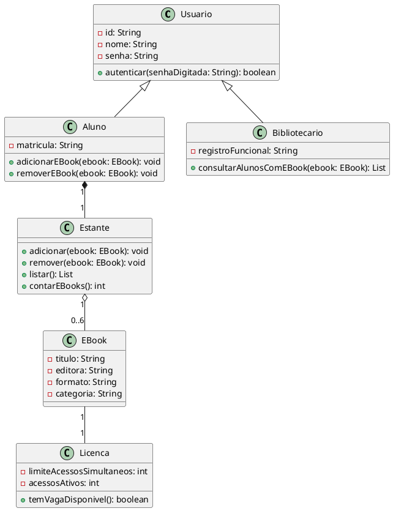

# Roteiro Hands-on, Sprint 2 (Lab01S02)

Sistema de Gestão de eBooks da Biblioteca Universitária

| Informação | Valor |
| --- | --- |
| Sprint | Lab01S02 |
| Valor | 4,0 pontos |
| Entregáveis | Diagrama de Classes (PlantUML) + Projeto Estrutural em Java |
| Mínimo por integrante | 1 agregação de classes |

Este roteiro complementa o enunciado do Laboratório 01 (Sistema de Gestão de eBooks da Biblioteca Universitária) e a Rubrica Individual Lab01S02. Consulte esses dois documentos para os critérios completos de avaliação, penalidades e prazos.

Nota de transparência sobre uso de IA: em conformidade com a política de uso responsável de Inteligência Artificial da disciplina, informa-se que este roteiro foi produzido com apoio da ferramenta Claude, da empresa Anthropic, utilizada na geração e revisão de texto, dos diagramas em PlantUML e dos exemplos de código. O conteúdo foi revisado pelo professor antes da disponibilização aos alunos.

## 1. Objetivo da Sprint

Nesta sprint, o grupo corrige o Diagrama de Casos de Uso conforme o feedback da Sprint 1, modela o Diagrama de Classes obrigatoriamente em PlantUML e cria o projeto Java correspondente, com classes, atributos e stub dos métodos modelados. Cada integrante deve ficar responsável por, no mínimo, 1 agregação de classes, mantendo o board e o documento de contribuição semanal atualizados.

A rubrica individual desta sprint distribui os 4,0 pontos e esta disponível na tarefa de entrega do Canvas

## 2. Pré-requisitos

- Sprint 1 concluída: Diagrama de Casos de Uso e Histórias de Usuário no repositório.
- Feedback da apresentação da Sprint 1 anotado (o que o professor pediu para corrigir).
- JDK (Java Development Kit) instalado.
- IDE configurada (IntelliJ IDEA, Eclipse, VS Code com extensões Java, entre outras).
- Acesso a uma ferramenta de PlantUML.

### Ferramentas de PlantUML sugeridas

- PlantUML Online: https://plantuml.online/
- PlantUML, site oficial: https://plantuml.com/
- PlantText: https://www.planttext.com/
- Documentação oficial: https://plantuml.com/guide

## 3. Conceitos-chave

### 3.1 Diagrama de Classes

O Diagrama de Classes representa a estrutura estática do sistema: as classes, seus atributos, seus métodos e como as classes se relacionam entre si.

Compartimentos de uma classe:

```plaintext
+------------------------+
| Aluno                  |   <- nome da classe
+------------------------+
| - matricula: String    |   <- atributos
+------------------------+
| + adicionarEBook()     |   <- métodos
+------------------------+
```

Visibilidade:

| Símbolo | Significado |
| --- | --- |
| `+` | público, acessível de qualquer lugar |
| `-` | privado, acessível apenas dentro da própria classe |
| `#` | protegido, acessível pela classe e suas subclasses |

Tipos de relacionamento:

| Relacionamento | Notação PlantUML | Quando usar |
| --- | --- | --- |
| Associação | `A -- B` | Duas classes se conhecem, sem relação de posse |
| Agregação | `A o-- B` | B pode existir independentemente de A (relação todo-parte fraca) |
| Composição | `A *-- B` | B não existe sem A (relação todo-parte forte) |
| Herança / Generalização | `A <\|-- B` | B é um tipo mais específico de A |

Multiplicidade: indica quantas instâncias participam da relação, escrita entre aspas antes de cada ponta da linha, por exemplo `"1" -- "0..*"` (um para muitos).

Diferença entre agregação e composição, na prática: uma Estante agrega EBook, porque um eBook continua existindo no catálogo mesmo que seja removido da estante de um aluno (agregação, losango vazio). Já um Aluno compõe sua Estante, porque a estante não existe sem o aluno dono dela (composição, losango cheio).

### 3.2 De casos de uso a classes

Uma técnica simples para identificar classes candidatas é reler os casos de uso e as histórias de usuário da Sprint 1 e sublinhar os substantivos relevantes. Muitos deles viram classes ou atributos. Por exemplo, "Como aluno, eu quero adicionar um eBook à minha estante" sugere as classes Aluno, EBook e Estante.

## 4. Passo a Passo

### Passo 1. Revisar o feedback da Sprint 1

Antes de qualquer coisa, releiam juntos as anotações da apresentação anterior. Separem o que precisa ser corrigido no Diagrama de Casos de Uso e nas Histórias de Usuário.

### Passo 2. Corrigir o Diagrama de Casos de Uso

Abram o arquivo `docs/diagramas/casos-de-uso.puml`, apliquem as correções solicitadas, gerem novamente a imagem e substituam o `.png` anterior.

```bash
git add docs/diagramas/casos-de-uso.puml docs/diagramas/casos-de-uso.png
git commit -m "fix: corrige diagrama de casos de uso conforme feedback da apresentacao"
git push origin main
```

### Passo 3. Identificar as classes candidatas

Em grupo, listem os substantivos relevantes dos casos de uso e histórias de usuário. Para este sistema, um bom ponto de partida:

- `Usuario` (classe-base para quem faz login)
- `Aluno`
- `Bibliotecario`
- `EBook`
- `Licenca`
- `Estante`

### Passo 4. Definir atributos e métodos de cada classe

Para cada classe, perguntem: "o que essa classe precisa saber?" (atributos) e "o que essa classe precisa fazer?" (métodos). Não incluam ainda métodos de infraestrutura (salvar em arquivo, por exemplo); isso será tratado na Sprint 3.

### Passo 5. Definir os relacionamentos e suas multiplicidades

Usando a tabela da seção 3.1, definam como as classes se relacionam. Neste sistema:

- `Usuario` é generalizado por `Aluno` e `Bibliotecario` (herança).
- `Aluno` compõe uma `Estante` (composição, a estante não existe sem o aluno).
- `Estante` agrega `EBook` (agregação, entre 0 e 6 eBooks, conforme o limite de 4 obrigatórios + 2 livres do enunciado).
- `EBook` está associado a uma `Licenca`.

### Passo 6. Distribuir as classes entre os integrantes

Cada integrante fica responsável por, no mínimo, 1 agregação de classes, ou seja, um agrupamento coerente de classes relacionadas (por exemplo, Estante e sua relação com EBook), e não apenas a criação isolada de uma única classe sem relacionamento. Registrem a distribuição no board.

### Passo 7. Modelar o Diagrama de Classes em PlantUML



Explicando o código linha a linha:

- `class Usuario { ... }`: declara a classe-base, com atributos privados (`-`) e um método público (`+`).
- `Usuario <|-- Aluno`: a seta triangular vazada indica que Aluno herda de Usuario.
- `Aluno "1" *-- "1" Estante`: composição, um aluno tem exatamente uma estante, e a estante não existe sem o aluno.
- `Estante "1" o-- "0..6" EBook`: agregação, uma estante agrega de 0 a 6 eBooks (4 obrigatórios + 2 livres, conforme o enunciado).
- `EBook "1" -- "1" Licenca`: associação simples, cada eBook está ligado a exatamente uma licença.

### Passo 8. Renderizar e exportar a imagem

Salve o arquivo-fonte como `docs/diagramas/diagrama-de-classes.puml` e exporte a imagem para `docs/diagramas/diagrama-de-classes.png`.

### Passo 9. Configurar o projeto Java

Crie a estrutura de pacotes dentro de `src/`, seguindo a convenção de nomes do grupo. Sugestão (já prevendo onde entram a persistência e o menu, que serão criados na Sprint 3):

```plaintext
src/
|-- br/edu/pucminas/biblioteca/
    |-- modelo/
    |   |-- Usuario.java
    |   |-- Aluno.java
    |   |-- Bibliotecario.java
    |   |-- EBook.java
    |   |-- Licenca.java
    |   |-- Estante.java
    |-- persistencia/
    |   |-- (classes de persistencia, criadas na Sprint 3)
    |-- MenuPrincipal.java (criado na Sprint 3)
```

Importante: toda classe dentro de `modelo/` deve começar com `package br.edu.pucminas.biblioteca.modelo;`, e toda classe dentro de `persistencia/` deve começar com `package br.edu.pucminas.biblioteca.persistencia;`. Sem essa linha, o projeto não compila a partir da estrutura de pastas proposta. Os exemplos de código a seguir já incluem essa linha.

### Passo 10. Criar as classes Java com atributos, construtores e stub dos métodos

Cada integrante cria as classes sob sua responsabilidade. Um stub é a assinatura do método, sem a implementação completa (isso fica para a Sprint 3). Crie também um construtor para cada classe, já nesta sprint, pois a Sprint 3 vai precisar instanciar objetos a partir dos dados persistidos.

```java
package br.edu.pucminas.biblioteca.modelo;

public class Usuario {
    private String id;
    private String nome;
    private String senha;

    public Usuario(String id, String nome, String senha) {
        this.id = id;
        this.nome = nome;
        this.senha = senha;
    }

    public boolean autenticar(String senhaDigitada) {
        // TODO: implementar na Sprint 3
        return false;
    }
}
```

```java
package br.edu.pucminas.biblioteca.modelo;

public class Aluno extends Usuario {
    private String matricula;
    private Estante estante;

    public Aluno(String id, String nome, String senha, String matricula) {
        super(id, nome, senha);
        this.matricula = matricula;
        this.estante = new Estante();
    }

    public void adicionarEBook(EBook ebook) {
        // TODO: implementar na Sprint 3
    }

    public void removerEBook(EBook ebook) {
        // TODO: implementar na Sprint 3
    }
}
```

```java
package br.edu.pucminas.biblioteca.modelo;

import java.util.ArrayList;
import java.util.List;

public class Estante {
    private List<EBook> ebooks = new ArrayList<>();

    public void adicionar(EBook ebook) {
        // TODO: implementar na Sprint 3
    }

    public void remover(EBook ebook) {
        // TODO: implementar na Sprint 3
    }

    public List<EBook> listar() {
        // TODO: implementar na Sprint 3
        return ebooks;
    }

    public int contarEBooks() {
        return ebooks.size();
    }
}
```

Observação: o método `contarEBooks()` já pode ser implementado por completo nesta sprint (basta retornar o tamanho da lista), pois será usado na validação do limite de eBooks na Sprint 3.

A classe `EBook` também precisa de um construtor com todos os atributos, pois a Sprint 3 vai recriar objetos EBook a partir dos dados persistidos em arquivo:

```java
package br.edu.pucminas.biblioteca.modelo;

public class EBook {
    private String titulo;
    private String editora;
    private String formato;
    private String categoria;

    public EBook(String titulo, String editora, String formato, String categoria) {
        this.titulo = titulo;
        this.editora = editora;
        this.formato = formato;
        this.categoria = categoria;
    }

    public String getTitulo() { return titulo; }
    public String getEditora() { return editora; }
    public String getFormato() { return formato; }
    public String getCategoria() { return categoria; }
}
```

Observação: os exemplos acima cobrem Usuario, Aluno, Estante e EBook. As demais classes do diagrama (Bibliotecario, Licenca) seguem o mesmo padrão: mesmo pacote `br.edu.pucminas.biblioteca.modelo`, atributos privados, construtor e stub dos métodos. Cada integrante cria as classes sob sua responsabilidade seguindo esse padrão.

### Passo 11. Verificar o alinhamento entre diagrama e código

Confira, classe por classe, se os nomes de atributos e métodos no Java batem exatamente com os nomes usados no `.puml`. Esse alinhamento é um dos critérios avaliados (peso 1,0, dentro do critério de implementação da classe).

### Passo 12. Atualizar o board e o documento de contribuição da semana

`docs/contribuicoes/nome-do-integrante-1/sprint2.md`

```markdown
## Semana 1
Contribuicao: modelei a agregacao Estante/EBook em PlantUML e criei
as classes Estante.java e EBook.java com os atributos e stubs dos
metodos correspondentes.
Decisoes: usei agregacao (o--) em vez de composicao entre Estante e
EBook, porque um eBook continua existindo no catalogo mesmo apos
ser removido da estante de um aluno.

## Semana 2
Contribuicao: adicionei os construtores das classes Estante e EBook,
e implementei por completo o metodo contarEBooks(), ja usado pela
validacao de limite que sera implementada na Sprint 3.
Decisoes: mantive o construtor de EBook com todos os atributos
obrigatorios, para simplificar a leitura dos dados persistidos.
```

Observação: se a sprint durar mais de uma semana, acrescente um novo bloco `## Semana N` ao mesmo arquivo a cada atualização, sem apagar os blocos anteriores.

### Passo 13. Commitar e enviar as alterações

Como vários integrantes vão editar arquivos dentro de `src/` na mesma sprint, use uma branch por integrante ou por classe, em vez de commitar direto na main. Isso reduz bastante o risco de um integrante sobrescrever o trabalho do outro.

```bash
git checkout main
git pull origin main
git checkout -b feature/classe-estante

git add docs/diagramas/diagrama-de-classes.puml docs/diagramas/diagrama-de-classes.png
git commit -m "docs: adiciona diagrama de classes em PlantUML"

git add src/
git commit -m "feat: cria estrutura inicial das classes do dominio"

git add docs/contribuicoes/nome-do-integrante-1/sprint2.md
git commit -m "docs: registra contribuicao semanal (sprint2)"

git push origin feature/classe-estante
```

Depois de enviar a branch, abra um Pull Request no GitHub para revisar e mesclar as alterações na main. Se o grupo preferir um fluxo mais simples, ao menos façam sempre `git pull origin main` antes de começar a trabalhar, para reduzir conflitos.

### Passo 14. Revisão final e preparação da apresentação

Confira o checklist da seção 6. Esteja pronto para explicar a classe (ou classes) sob sua responsabilidade, os atributos e métodos escolhidos, e como ela se relaciona com as demais classes do diagrama.

## 5. Erros Comuns e Dicas

- Diagrama de classes divergente dos casos de uso. Toda classe deve poder ser rastreada até algum caso de uso ou história de usuário da Sprint 1.
- Confundir agregação com composição. Pergunte sempre: "a parte sobrevive sem o todo?" Se sim, é agregação; se não, é composição.
- Métodos sem retorno definido. Mesmo em um stub, declare o tipo de retorno correto (`void`, `boolean`, `List`, etc.), pois isso já faz parte da modelagem.
- Esquecer de commitar o projeto Java. É comum o grupo commitar só o diagrama e esquecer o código; ambos são avaliados.
- Trabalhar direto na main em grupo. Sem branches, é fácil um integrante sobrescrever o trabalho do outro. Prefira uma branch por integrante ou por classe, com Pull Request para juntar o trabalho.

## Rubrica

Lab1Sprint2

| Critérios | Avaliações | Pts |
| --- | --- | --- |
| **Diagrama de Classes** — Agregação de classes sob responsabilidade do integrante (PlantUML) | **2 pts, Completo:** Diagrama de classes completo, em plantUML e atualizado no repositório. **1 pt, Parcial:** Diagrama de classes parcial ou criado com ferramenta diferente de plantUML ou não atualizado no repositório. **0 pts, Não realizado:** Sem nenhuma evidência do diagrama. | 2 |
| **Protótipos de classes** — Implementação da classe no projeto Java | **1 pt, Completo:** Todos os prototipos de classes implementados corretamente e publicados no repositório. **0,5 pt, Parcial:** Prototipos de classes implementados parcialmente ou incorretamente ou não publicados no repositório. **0 pts, Sem evidências:** Sem evidências de implementação. | 1 |
| **Correções** — Correção das observações da sprint anterior (parte do integrante) | **0,5 pt, Realizada. 0 pts, Sem evidências.** | 0,5 |
| **Documento de Contribuição** — Atualização semanal do documento de contribuição (`docs/contribuicoes/`) | **0,5 pt, Atualizado. 0 pts, Sem evidências.** | 0,5 |

Total de pontos: 4
